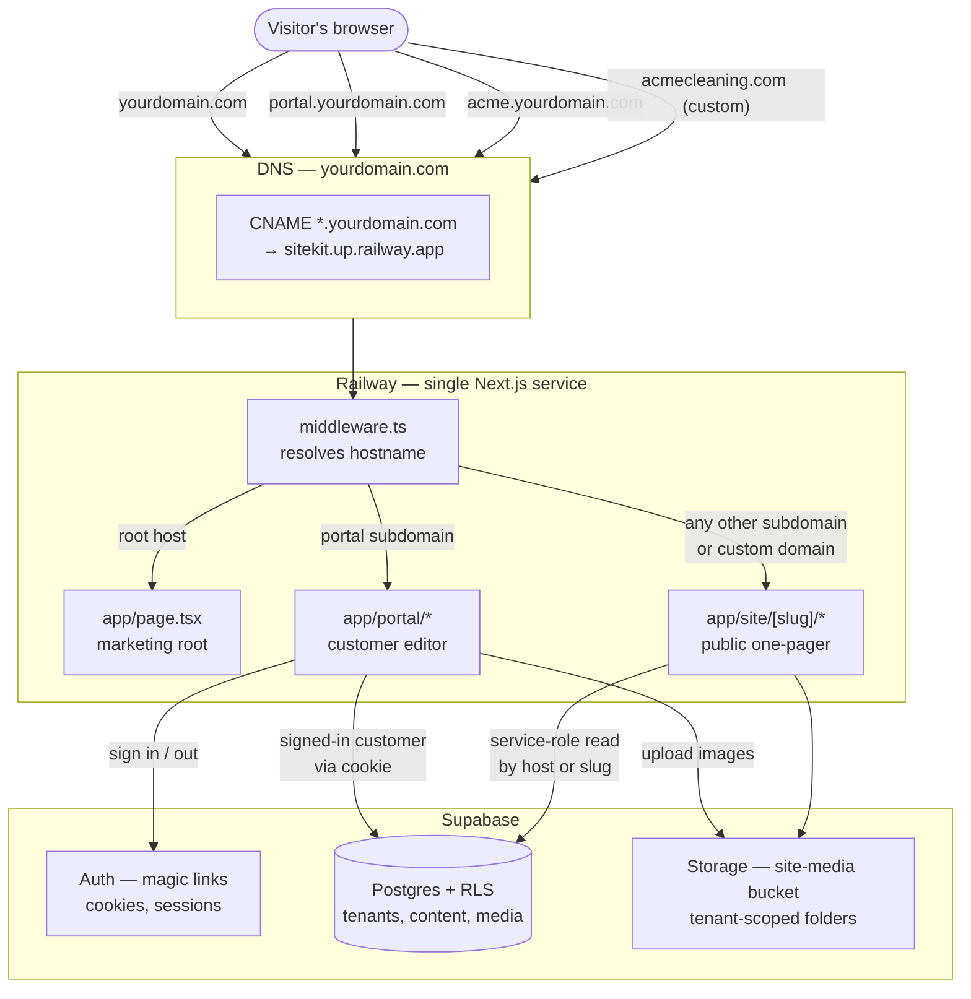
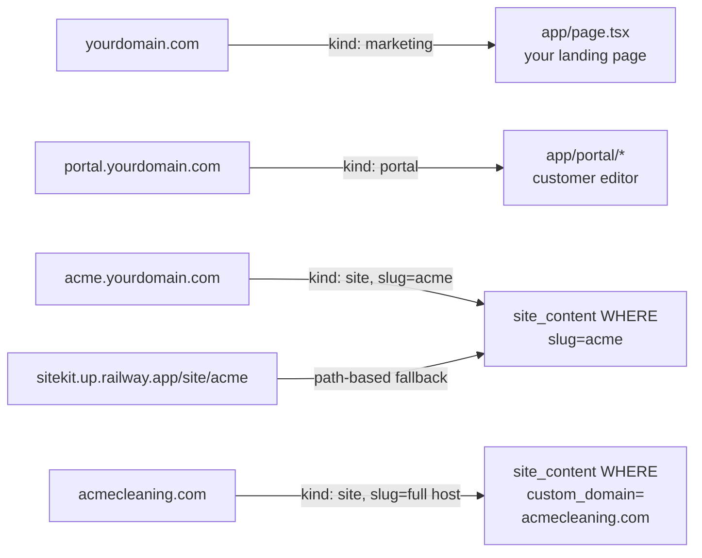
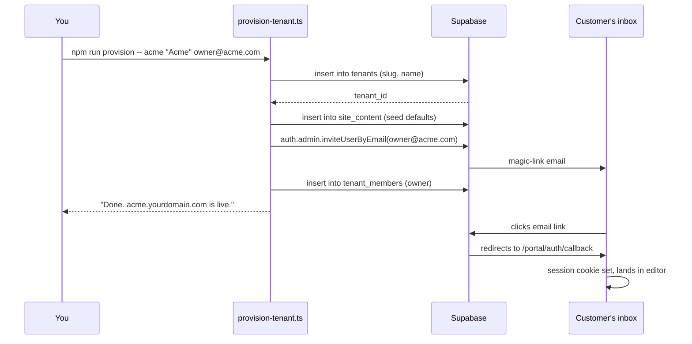
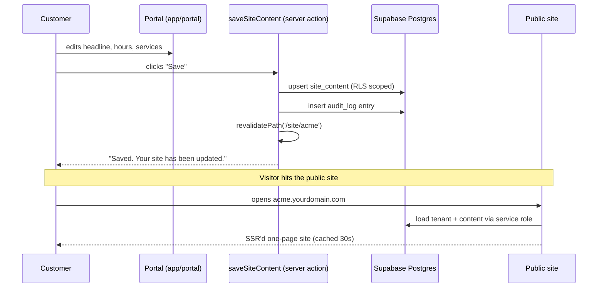
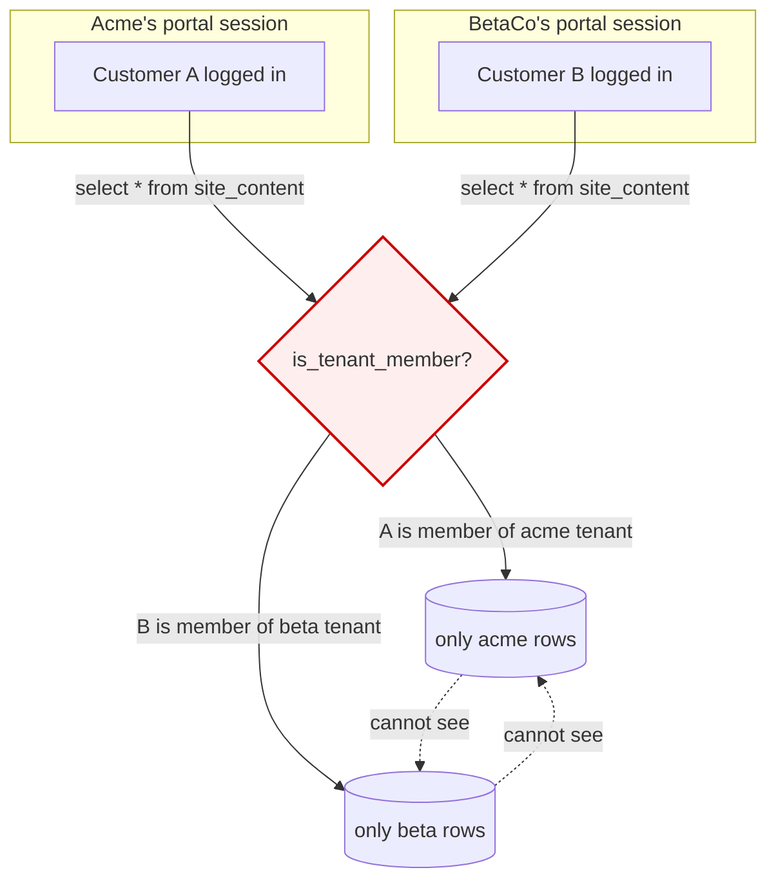
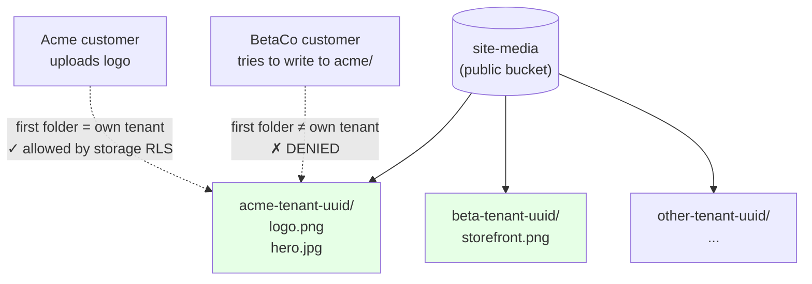

# SiteKit Architecture Flow Charts

Mermaid diagrams below render automatically on GitHub. Open this file there
(or any Markdown viewer with Mermaid support) for the visual.

## 1. How a request gets routed (the big picture)

## 2. What hostname maps to what content

## 3. Onboarding a new customer (your workflow)

## 4. Customer self-serve (zero involvement from you)

## 5. Tenant isolation (RLS keeps customers separate)

## 6. Where storage lives

